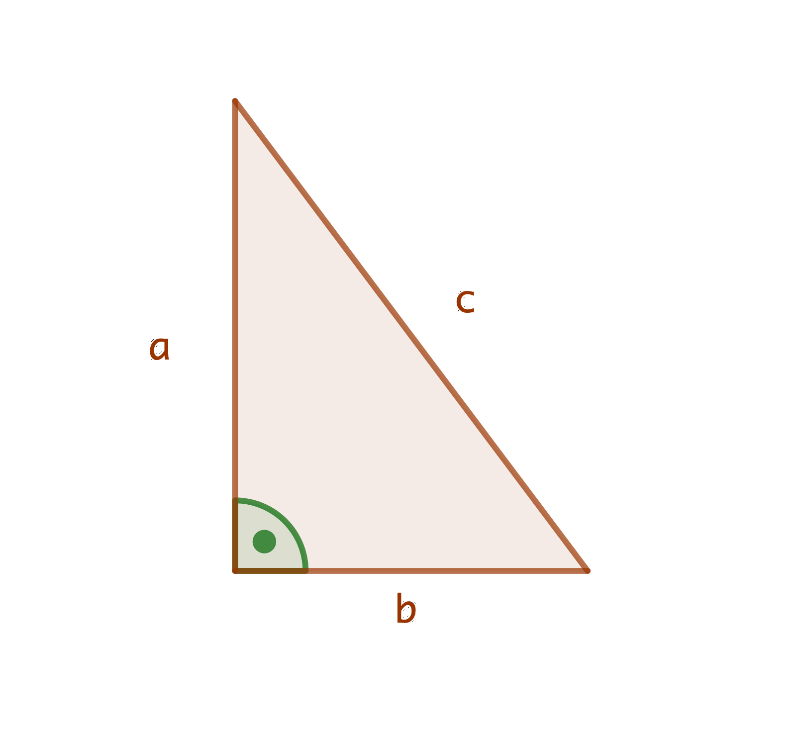

#### Frage (*BiT+basal1+Grundoperationen+leicht*)
Vereinfache $a+a+a$

#### Antwort
$3a$

---
#### Frage (*HaeK+basal1+BinomischeFormeln+leicht*)
Ergänze den Ausdruck: $(2x+3)^2=4x^2+....+9$

#### Antwort
$4x^2+12x+9$

---
#### Frage (*HaeK+basal1+Einheiten+leicht*)
Übersetze 1 Liter in die Einheit dm$^3$.

#### Antwort
1 dm$^3$

---
#### Frage (*HaeK+basal1+n-Ecke,Begrifflichkeiten,Dreieck+leicht*)
Gib die Innenwinkelsumme eines Dreiecks an.

#### Antwort
$180^\circ$

---
#### Frage (*HaeK+basal2+Koordinatensystem,Begrifflichkeiten+leicht*)
In welchem Quadranten liegt der Punkt $(-1;5)$?

#### Antwort
Im 2. Quadranten.

---
#### Frage (*HaeK+basal2+Bruchrechnen+mittel*)
Vereinfache $\frac{125}{81}\cdot\frac{27}{25}$.

#### Antwort
$\frac{5}{3}$

---
#### Frage (*HaeK+basal2+Potenzen,Grundoperationen+leicht*)
Berechne $-2^2$.

#### Antwort
$-4$

---
#### Frage (*HaeK+basal2+Potenzen+leicht*)
Berechne $7.2\cdot10^7 -1.8\cdot10^{6}$.

#### Antwort
$7.02\cdot10^7$

---
#### Frage (*HaeK+basal2+BinomischeFormeln,Termumformungen+mittel*)
Multipliziere $(2x+\sqrt{x+5})^2$ aus.

#### Antwort
$4x^2+4x\sqrt{x+5}+x+5$

---
#### Frage (*HaeK+basal2+Mathematisieren+leicht*)
Übersetze in eine Gleichung: a ist um 4 grösser als b.

#### Antwort
$a=b+4$

---
#### Frage (*HaeK+basal2+Mathematisieren+leicht*)
Übersetze in eine Gleichung: a ist um 4 kleiner als b.

#### Antwort
$a=b-4$

---
#### Frage (*HaeK+basal2+Grundoperationen+leicht*)
Teile die Gleichung $4x+7=8y-1$ durch 4.

#### Antwort
$x+\frac{7}{4}=2y-0.25$

---
#### Frage (*HaeK+basal2+Potenzen+leicht*)
Berechne $(-1)^{456987}$.

#### Antwort
$-1$

---
#### Frage (*HaeK+basal2+Potenzen+leicht*)
Berechne $(-1)^{456978}$.

#### Antwort
$1$

---
#### Frage (*HaeK+basal2+Potenzen+mittel*)
Ordne $2^{-3}, 2^3,(-2)^{-3}, (-2)^3$ nach aufsteigender Grösse.

#### Antwort
$(-2)^3=-8, (-2)^{-3}=-\frac{1}{8}, 2^{-3}=\frac{1}{8}, 2^3=8$

---
        #### Frage (*HaeK+basal1+Bruchrechnen+schwer*)
        Welcher Bruch hat einen anderen Wert als die drei anderen?

$$\dfrac{4}{-3}, \dfrac{-4}{-3}, -\dfrac{4}{3}, \dfrac{-4}{3}$$

        #### Antwort
        $\frac{-4}{-3}=\frac{4}{3}$

        
        ---
        
        
        #### Frage (*HaeK+basal1+Kreisberechnung+mittel*)
        Gib den Umfang des Kreissektors an.

{width="30%"}

        #### Antwort
        $6+\frac{3}{2}\pi$

        
        ---
        
        
        #### Frage (*HaeK+basal2+Proportionalitäten+mittel*)
        Gib die Funktionsgleichung des Graphen an.

{width="45%"}

\vspace{-0.2cm}

        #### Antwort
        $y=2.5x$

        
        ---
        
        
        #### Frage (*HaeK+basal2+Funktionsauswertung+mittel*)
        Drücke die Aussage Durch die Funktion $f$ wird der Zahl 2 die Zahl 78
zugeordnet in mathematischer Schreibweise aus.

        #### Antwort
        $f(2)=78$

        
        ---
        
        
#### Frage (*BiT+basal2+Grundoperationen+leicht*)
Vereinfache $a\cdot a \cdot a$

#### Antwort
$a^3$

---
        #### Frage (*WiD+basal1+Pythagoras+leicht*)
        Berechne in einem rechtwinkligen Dreieck die Kathete $a$ falls $b=4$ und
$c=5$.

{width="50%"}

        #### Antwort
        $c^2=a^2+b^2 \rightarrow a=3$

        
        ---
        
        
        #### Frage (*WiD+basal1+Ähnlichkeit+leicht*)
        In einem gleichschenkligen Dreieck misst der eine Basiswinkel
$\alpha=37^{\circ}$. Berechne die restlichen Winkel im Dreieck.

        #### Antwort
        $\alpha=\beta=37^{\circ} \rightarrow \gamma=180^{\circ}-2\cdot 37^{\circ}=106^{\circ}$

        
        ---
        
        
        #### Frage (*WiD+basal1+Dreieck+leicht*)
        Was ist korrekt?\
Der Inkreismittelpunkt eines Dreiecks ist der Schnittpunkt der

-   Seitenhalbierenden

-   Mittelsenkrechten

-   Winkelhalbierenden

-   Höhenlinien

        #### Antwort
        c)

        
        ---
        
        
        #### Frage (*WiD+basal1+Viereck+leicht*)
        Welche Aussagen über Rhomben sind korrekt?\

-   Im Rhombus halbieren sich die Diagonalen.

-   Zwei gegenüberliegende Winkel ergänzen sich zu $180^{\circ}$.

-   Ein Rhombus ist ein Rechteck.

-   Gegenüberliegende Seiten sind parallel.

        #### Antwort
        a),d)

        
        ---
        
        
        #### Frage (*WiD+basal1+Bruchrechnen+mittel*)
        Vereinfache soweit als möglich\
$$\frac{1}{a-1}-\frac{a+1}{a^2-1}+\frac{1}{a}$$

        #### Antwort
        $\frac{1}{a}$

        
        ---
        
        
        #### Frage (*WiD+basal1+Koordinatensystem+leicht*)
        Spiegle den Punkt $A=(2;5)$ an der

-   $x$-Achse

-   $y$- Achse

        #### Antwort
        a\) $A'=(2;-5)$ b) $A''=(-2;5)$

        
        ---
        
        
#### Frage (*WiD+basal1+Koordinatensystem+mittel*)
Spiegle den Punkt $A=(-2;5)$ am Punkt $S=(1;4)$

#### Antwort
$A'=(4;3)$

---
        #### Frage (*ScM+basal1+Mathematisieren+mittel*)
        Beschreibe alle grünen Flächen mit einem Term (z.B. ist die Fläche des
oranges Quadrats oben links $a^2$.) und vereinfache diesen soweit als
möglich.

{width="30%"}

        #### Antwort
        $2ab+2ac+b^2+c^2$

        
        ---
        
        
#### Frage (*WaJ+basal1+Potenzen+mittel*)
$$2\cdot10^5\cdot7\cdot10^9=\;?$$

#### Antwort
$14\cdot10^{14}=1.4\cdot10^{15}$

---
#### Frage (*WaJ+basal1+Bruchrechnen+mittel*)
$$\frac{2}{3}-\frac{5}{7}=\;?$$

#### Antwort
$-\frac{1}{21}$

---
#### Frage (*WaJ+basal2+Potenzen+mittel*)
$$\sqrt{4\cdot10^{12}}=\;?$$

#### Antwort
$2\cdot10^6$

---
#### Frage (*WaJ+basal2+Bruchrechnen+schwer*)
$$\frac{2x}{\frac{4x}{5}}=\;?$$

#### Antwort
$\frac{5}{2}$

---
#### Frage (*WaJ+basal2+Bruchgleichungen+mittel*)
Löse nach $x$: $$-\frac{3}{7}x+5=2$$

#### Antwort
$x=7$

---
#### Frage (*WaJ+basal1+Einheiten+leicht*)
$$\unitfrac[72]{km}{h}=\unitfrac[\;?]{m}{s}$$

#### Antwort
$\unitfrac[20]{m}{s}$

---
#### Frage (*WaJ+basal1+Einheiten+leicht*)
$$\unit[200]{Liter}=\unit[\;?]{m^3}$$

#### Antwort
$\unit[0.2]{m^3}$

---
#### Frage (*WaJ+basal2+Funktionsauswertung+leicht*)
Sei $f(x)=\frac{1}{2}x-1$. Bestimme $$f(-3)$$

#### Antwort
$f(-3)=-\frac{5}{2}$

---
#### Frage (*WaJ+basal2+Funktionsauswertung+leicht*)
Sei $f(x)=x^2$. Bestimme $$f(-2)$$

#### Antwort
$f(-2)=4$

---
#### Frage (*WaJ+basal1+BinomischeFormeln,Grundoperationen+mittel*)
Faktorisiere $$x^2-2x+1$$

#### Antwort
$(x-1)^2$

---
#### Frage (*WaJ+basal1+BinomischeFormeln,Grundoperationen+leicht*)
$$\left(2-\sqrt{2}\right)\left(2+\sqrt{2}\right)=\;?$$

#### Antwort
$2$

---
        #### Frage (*WaJ+basal1+Pythagoras+leicht*)
        Gegeben seien die Katheten $a=\unit[4]{m}$ und $b=\unit[3]{m}$. Wie lang
ist die Seite $c$?

{width="38.2%"}

        #### Antwort
        $c=\unit[5]{m}$

        
        ---
        
        
        #### Frage (*WaJ+basal1+Pythagoras+mittel*)
        Gegeben seien die Kathete $a=\unit[4]{m}$ und die Hypotenuse
$c=\unit[5]{m}$. Wie lang ist die Seite $b$?

{width="38.2%"}

        #### Antwort
        $c=\unit[3]{m}$

        
        ---
        
        
#### Frage (*WaJ+basal1+Proportionalitäten+mittel*)
Wie viel sind $\unit[80]{\%}$ von $\unit[80]{\%}$ von $200$.

#### Antwort
$128$

---
#### Frage (*WaJ+basal1+Kreisberechnung+leicht*)
Wie lang ist der Umfang eines Kreises mit Radius $\unit[2]{m}$?

#### Antwort
$\unit[4\pi]{m}$

---
#### Frage (*WaJ+basal1+Kreisberechnung+leicht*)
Wie gross ist die Fläche eines Kreises mit Radius $\unit[2]{m}$?

#### Antwort
$\unit[4\pi]{m^2}$

---
#### Frage (*WaJ+basal1+Kreisberechnung+mittel*)
Wie gross ist die Fläche eines Kreises mit Durchmesser $\unit[1.6]{m}$?

#### Antwort
$\unit[\frac{16}{25}\pi]{m^2}$

---
        #### Frage (*WaJ+basal1+Kreisberechnung+schwer*)
        Wie gross ist der Durchmesser eines Kreises mit Flächeninhalt
$\unit[\frac{9\pi}{4}]{m^2}$?

        #### Antwort
        $\unit[3]{m}$

        
        ---
        
        
#### Frage (*WaJ+basal1+Termumformungen+leicht*)
$$2a-(4+a)=\;?$$

#### Antwort
$a-4$

---
#### Frage (*WaJ+basal1+Termumformungen+mittel*)
$$2a-(4+a)\cdot(-2)=\;?$$

#### Antwort
$4(a+2)$

---
#### Frage (*WaJ+basal1+Termumformungen+mittel*)
$$(-2)\cdot(-3)^2=\;?$$

#### Antwort
$-18$

---
#### Frage (*WaJ+basal1+Termumformungen+leicht*)
$$xy+x+y-yx=\;?$$

#### Antwort
$x+y$

---
#### Frage (*WaJ+basal1+Termumformungen+leicht*)
$$3-\frac{7}{5}=\;?$$

#### Antwort
$\frac{8}{5}$

---
#### Frage (*WaJ+basal1+Termumformungen+schwer*)
$$\left(1-3\cdot\left(-\frac{7}{6}\right)\right)^2=\;?$$

#### Antwort
$\frac{81}{4}$

---
#### Frage (*WaJ+basal1+Bruchrechnen+leicht*)
$$\frac{2}{3}+\frac{2}{3}=\;?$$

#### Antwort
$\frac{4}{3}$

---
#### Frage (*WaJ+basal1+Bruchrechnen+leicht*)
$$\frac{2}{3}+\frac{3}{2}=\;?$$

#### Antwort
$\frac{13}{6}$

---
#### Frage (*WaJ+basal1+Bruchrechnen+mittel*)
$$\frac{2}{-3}+\frac{3}{2}\cdot\frac{4}{9}=\;?$$

#### Antwort
$0$

---
#### Frage (*WaJ+basal1+Bruchrechnen+schwer*)
$$\frac{\frac{4}{3}}{\frac{1}{2}}-\frac{3}{7}\cdot\frac{35}{9}=\;?$$

#### Antwort
$1$

---
        #### Frage (*GiD+basal1+Bruchrechnen+leicht*)
        Vereinfache den gewöhnlichen Bruch so weit wie möglich.
$$\frac{5}{6}+\frac{2}{5}=\;?$$ $$\frac{5}{6}\cdot\frac{2}{5}=\;?$$

        #### Antwort
        $\frac{37}{30}=1\frac{7}{30} ; \frac{1}{3}$

        
        ---
        
        
#### Frage (*WaJ+basal1+Termumformungen+mittel*)
$$4-2^4\cdot3=\;?$$

#### Antwort
$-44$

---
#### Frage (*WaJ+basal1+Termumformungen+mittel*)
$$4-3\cdot(-2)^3=\;?$$

#### Antwort
$28$

---
#### Frage (*WaJ+basal1+Dreieck+leicht*)
In einem gleichseitigen Dreieck betragen die Winkel ...$^\circ$

#### Antwort
$60^\circ$

---
        #### Frage (*WaJ+basal1+Dreieck+leicht*)
        In einem rechtwinkligen, gleichschenkligen Dreieck betragen die
Basiswinkel ...$^\circ$

        #### Antwort
        $45^\circ$

        
        ---
        
        
        #### Frage (*WaJ+basal1+Dreieck+mittel*)
        In einem gleichschenkligen, rechtwinkligen Dreieck mit Kathetenlängen
jeweils $1$ beträgt die Hypotenuse ...

        #### Antwort
        $\sqrt{2}$

        
        ---
        
        
        #### Frage (*WaJ+basal1+Dreieck+mittel*)
        Wenn in einem rechtwinkligen Dreieck die Hypotenuse $3$ und eine Kathete
$2$ lang ist, dann ist die andere Kathete ... lang.

        #### Antwort
        $\sqrt{5}$

        
        ---
        
        
        #### Frage (*WaJ+basal1+Dreieck+schwer*)
        In einem gleichseitigen Dreieck betrage die Höhe $\sqrt{3}$. Wie lang
ist eine Seite?

        #### Antwort
        $2$

        
        ---
        
        
#### Frage (*RoK+basal2+Potenzen+leicht*)
$20~m^2$ entsprechen $2\cdot 10^x~mm^2$.

#### Antwort
$x=7$

---
        #### Frage (*RoK+basal1+Kreisberechnung+leicht*)
        Ein Velorad hat einen Durchmesser von 28 Zoll. Ein Zoll entspricht 2.54
cm. Wie weit fährt das Velo mit einer Radumdrehung?

        #### Antwort
        223.43 cm

        
        ---
        
        
#### Frage (*RoK+basal1+Bruchrechnen+leicht*)
Berechne den Kehrwert von $\frac{1}{3}-\frac{1}{4}$.

#### Antwort
12

---
#### Frage (*RoK+basal1+Grundoperationen+leicht*)
Berechne $x=\sqrt{13^2-3^2-12^2}$.

#### Antwort
$x=4$

---
        #### Frage (*RoK+basal2+Bruchgleichungen,Bruchrechnen+leicht*)
        Multipliziere die Gleichung zuerst mit a und anschliessend mit b.\
$$\frac{2}{a}+\frac{3}{b}=\frac{5}{ab}$$

        #### Antwort
        $2b+3a=5$

        
        ---
        
        
        #### Frage (*RoK+basal1+Begrifflichkeiten,Einheiten+leicht*)
        Dein Vermögen wird um 10% erhöht. Anschliessend nimmt es wieder um 10%
ab. Ist dein Vermögen nun grösser, kleiner oder gleich gross wie zu
Beginn?

        #### Antwort
        kleiner

        
        ---
        
        
#### Frage (*RoK+basal1+Grundoperationen+leicht*)
Berechne: $$-5(2a-7)=\;?$$ $$5-(2a-7)=\;?$$

#### Antwort
$35-10a$ und $12-2a$

---
        #### Frage (*RoK+basal1+Mathematisieren,Proportionalitäten+leicht*)
        Du legst eine 10 km lange Strecke zweimal zurück. Auf dem Hinweg bist du
mit 20 km/h unterwegs, auf dem Rückweg mit 60 km/h. Wie lautet deine
Durchschnittsgeschwindigkeit?

        #### Antwort
        30 km/h

        
        ---
        
        
        #### Frage (*RoK+basal1+Mathematisieren,Proportionalitäten+leicht*)
        Ein Liter 50-prozentiger Alkohol wird mit zwei Litern 20-prozentigem
Alkohol gemischt. Welchen Alkoholgehalt hat die entstandene Mischung?

        #### Antwort
        30 %

        
        ---
        
        
#### Frage (*RoK+basal1+Potenzen+leicht*)
Für welche reellen Zahlen $r$ gilt: $$r^2<r$$

#### Antwort
$0<r<1$

---
#### Frage (*RoK+basal1+Proportionalitäten+leicht*)
6% von 300 Franken sind gleich viel wie p% von 200 Franken.

#### Antwort
$p=4\%$

---
        #### Frage (*MaI+basal1+Bruchrechnen+mittel*)
        Vereinfache soweit wie möglich\
$$\frac{3a^2d-3b^2d}{9b-9a}$$

        #### Antwort
        $\frac{-d(a+b)}{3}$

        
        ---
        
        
        #### Frage (*MaI+basal2+Wurzel,Bruchrechnen+mittel*)
        Vereinfache soweit wie möglich\
$$\frac{\sqrt{3}}{\sqrt{2}}\div \left(\frac{3\sqrt{3}}{\sqrt{2}}+\frac{\sqrt{6}}{\sqrt{15}}\right)$$

        #### Antwort
        $\frac{45+2\sqrt{15}}{10}$

        
        ---
        
        
#### Frage (*MaI+basal1+Grundoperationen+leicht*)
Berechne: $$(2a+3b)\cdot 2a=\;?$$ $$(2a \cdot 3b)\cdot 2a=\;?$$

#### Antwort
$4a^2+6ab$ und $12a^2b$

---
        #### Frage (*MaI+basal1+Mathematisieren+leicht*)
        Tim hat x Wochen lang wöchentlich 9 Franken, y Wochen lang wöchentlich
10 Franken und z Wochen lang wöchentlich 11 Franken Taschengeld
erhalten. Geben Sie in Worten an, was in diesem Zusammenhang durch den
folgenden Term dargestellt wird: $$\frac{9x+10y+11z}{x+y+z}$$

        #### Antwort
        durchschnittliches Sackgeld pro Woche

        
        ---
        
        
#### Frage (*MaI+basal1+Mathematisieren,Bruchrechnen+leicht*)
Schreib den Term: Das Dreifache einer um 5 verminderten Zahl x.

#### Antwort
$3\cdot (x-5)$

---
        #### Frage (*MaI+basal1+Mathematisieren+leicht*)
        Schreib die Gleichung auf und gib die Lösung an: Bei welcher Zahl ist es
gleichgültig, ob man sie mit 10 multipliziert oder 10 davon subtrahiert?

        #### Antwort
        $\frac{-10}{9}$

        
        ---
        
        
        #### Frage (*MaI+basal1+Mathematisieren+leicht*)
        Schreib die Gleichung auf und gib die Lösung an: Wenn man vom Viertel
einer Zahl ein Fünftel derselben Zahl subtrahiert, so ergibt sich 4.

        #### Antwort
        $\frac{x}{4}-\frac{x}{5}=4$ ergibt $x=80$

        
        ---
        
        
        #### Frage (*MaI+basal1+Funktionsauswertung+leicht*)
        Gegeben ist die Funktion $f(x)=\frac{2x-1}{x-3}$.\

-   Bestimme den Funktionswert an der Stelle $7$

-   An welcher Stelle ist der Funktionswert $7$?

        #### Antwort
        a)$\frac{13}{4}$ b) $4$

        
        ---
        
        
        #### Frage (*MaI+basal1+Funktionsauswertung+leicht*)
        Gegeben ist die Funktion $f(x)=\frac{2x-1}{x-3}$.\
Bestimme die Nullstelle der Funktion $f$.\

        #### Antwort
        $\frac{1}{2}$

        
        ---
        
        
        #### Frage (*MaI+basal1+Funktionsauswertung+leicht*)
        Gegeben ist die Funktion $f(x)=\frac{2x-1}{x-3}$.\
Gib den Definitionsbereich der Funktion $f$ an.\

        #### Antwort
        $\mathbb{R}\setminus\{3\}$

        
        ---
        
        
        #### Frage (*MaI+basal1+Funktionsauswertung+leicht*)
        Gegeben ist die Funktion $f(x)=\frac{2x-1}{x-3}$.\
Liegt der Punkt P(2/3) auf dem Graphen der Funktion $f$?

        #### Antwort
        nein

        
        ---
        
        
        #### Frage (*MaI+basal1+Funktionsauswertung+leicht*)
        Gegeben ist die Funktion $f(x)=\sqrt{2x-3}$.\

-   Bestimme den Funktionswert an der Stelle $6$

-   An welcher Stelle ist der Funktionswert $5$?

        #### Antwort
        a)$3$ b) $14$

        
        ---
        
        
        #### Frage (*MaI+basal1+Funktionsauswertung+leicht*)
        Gegeben ist die Funktion $f(x)=\sqrt{2x-3}$.\
Bestimme die Nullstelle der Funktion $f$.\

        #### Antwort
        $\frac{3}{2}$

        
        ---
        
        
        #### Frage (*MaI+basal1+Funktionsauswertung+leicht*)
        Gegeben ist die Funktion $f(x)=\sqrt{2x-3}$.\
Gib den Definitionsbereich der Funktion $f$ an.\

        #### Antwort
        $\{x\mid x \geq \frac{3}{2} \}$

        
        ---
        
        
        #### Frage (*MaI+basal1+Funktionsauswertung+leicht*)
        Gegeben ist die Funktion $f(x)=\sqrt{2x-3}$.\
Liegt der Punkt P(2/1) auf dem Graphen der Funktion $f$?\

        #### Antwort
        ja

        
        ---
        
        
        #### Frage (*MaI+basal1+Funktionsauswertung+leicht*)
        Gegeben sind die Graphen der Funktionen f und g.\
{width="50%"}\
Bestimme die Stellen (ungefähr) bei denen der Funktionswert von f und
der von g übereinstimmt.\

        #### Antwort
        $\frac{-1}{2}$ und $\frac{3}{2}$

        
        ---
        
        
        #### Frage (*MaI+basal1+Funktionsauswertung+leicht*)
        Gegeben sind die Graphen der Funktionen f und g.\
{width="50%"}\
Bestimme den Funktionswert von f an der Stelle Null.\

        #### Antwort
        $1$

        
        ---
        
        
        #### Frage (*MaI+basal1+Funktionsauswertung+leicht*)
        Gegeben sind die Graphen der Funktionen f und g.\
{width="50%"}\
An welcher Stelle ist der Funktionswert von f gleich $-1$.\

        #### Antwort
        $1$

        
        ---
        
        
        #### Frage (*MaI+basal1+Funktionsauswertung+leicht*)
        Gegeben sind die Graphen der Funktionen f und g.\
{width="50%"}\
Bestimme den Funktionswert von g an der Stelle Null.\

        #### Antwort
        $3$

        
        ---
        
        
